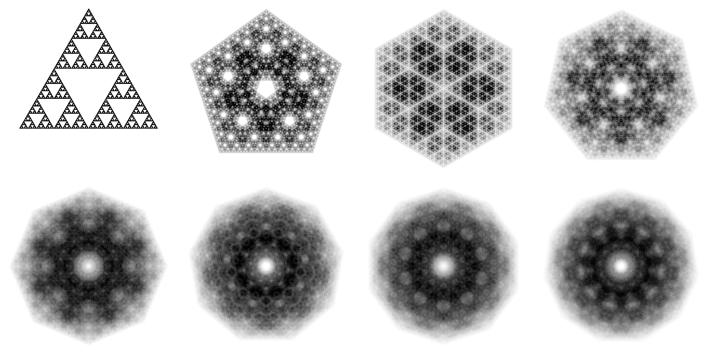

# chaos_fractal

Implementation of chaos game fractals using Rust on CPU & GPU (wgpu).



## Installation

You might need to [install ffmpeg's dev dependencies](https://github.com/zmwangx/rust-ffmpeg/wiki/Notes-on-building).

```bash
cargo run --release
```

## Usage

For a list of available commands:

```bash
cargo run --release -- --help
```